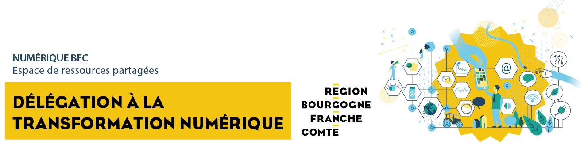

# Espace de ressources partagées



Première région à adopter une **Politique Publique des Usages Numériques**, la Bourgogne-Franche-Comté fait de la transition numérique une priorité citoyenne, économique et écologique.





La **Stratégie de Cohérence pour l’Aménagement Numérique en Bourgogne-Franche-Comté** \(SCORAN BFC\) constitue le document de référence stratégique en matière de développement numérique pour l’ensemble des acteurs territoriaux de la région. La vocation de ce document est d’anticiper et d’accompagner les changements induits par les enjeux de numérisation de l’économie, de la société et des territoires et de fixer des perspectives à court, moyen \(5 ans\) et plus long terme \(10-15 ans\).














Cet espace de ressources en ligne est maintenu par l'équipe de la Délégation à la Transformation Numérique du [Conseil régional de Bourgogne-Franche-Comté](https://www.bourgognefranchecomte.fr).


