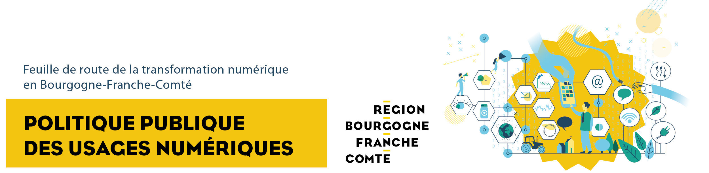

# Politique Publique des Usages Numériques



#### **La Région Bourgogne-Franche-Comté a très tôt fait des transitions numériques une priorité.**

Parce que le numérique prend une place croissante dans la vie sociale des Français et dans l’économie, notre collectivité a largement investi pour accélérer le déploiement des infrastructures, et garantir au plus grand nombre les conditions d’un accès aux services publics, au savoir, à l’éducation, au développement économique ou au divertissement. 

Aujourd’hui, cette question de l’égalité devant la connexion, et à travers elle, celle de l’équilibre entre les territoires, ne fait plus débat. La période de crise sanitaire a rappelé avec plus de force encore l’urgence de ces sujets, et la nécessité, pour chacun, de bénéficier de la continuité pédagogique, de l’accès au soin par la téléconsultation médicale, la commande en ligne auprès des commerces de proximité… 

Mais cet immense champ des possibles, qui va continuer de bouleverser notre quotidien, ne va pas sans un besoin croissant d’accompagnement, de protection, et d’apprentissage. Nos concitoyens ont autant besoin de l’outil numérique, que d’apprendre à savoir s’en servir et d’en appréhender les dangers. En adoptant sa Politique publique des usages du numérique, la Région entend prendre ces sujets à bras le corps et fixer un cap à tenir pour la décennie à venir. 

Au cœur de la démarche se trouve l’émergence d’un vrai service public du numérique, dont la mission sera de garantir que l’essor du numérique soit une chance à la fois pour chaque citoyen d’accéder à des services ou des ressources, et pour chaque territoire de bénéficier d’un levier pour l’économie régionale, le développement durable ou la protection de l’environnement. 

Lutter contre la fracture sanitaire et l’exclusion numérique, protéger l’économie de proximité et accompagner l’aménagement du territoire, les usages du numérique sont éminemment au centre des enjeux, d’aujourd’hui et de demain. 

Marie-Guite Dufay   
Présidente de la Région Bourgogne-Franche-Comté



#### **Première région à adopter une Politique Publique des Usages Numériques, la Bourgogne-Franche-Comté fait de la transition numérique une priorité citoyenne, économique et écologique.**

**La révolution numérique bouleverse le quotidien des citoyens, des entreprises et des administrations.** Dans une région essentiellement rurale, où 97 % des communes comptent moins de 3.500 habitants, **l’arrivée prochaine de la fibre optique va accélérer ces changements, faisant des usages numériques la question majeure de la décennie qui s’ouvre**. 

La crise sanitaire qui frappe le monde depuis 2020 a amplifié les besoins, les attentes et les pratiques numériques des Français. Télétravail, télémédecine, relations sociales, commerce, enseignement, recherche, loisirs… l’accélération des pratiques numériques est fulgurante. Et dans le même temps la situation de ceux qui n’ont pas accès à internet Très Haut Débit ou qui ne sont pas à l’aise avec le numérique s’est aggravée. Le numérique est un nouveau facteur d’inégalités économiques et sociales contre lesquelles la Région se mobilise. 

La première priorité est donc bien de relever le défi de l’inclusion numérique en aidant tous ceux qui ne sont pas à l’aise avec ces outils. Il s’agit aussi de respecter le choix de ceux qui ne veulent pas du numérique, en garantissant notamment qu’ils puissent garder un accès traditionnel aux services publics. 

La seconde priorité est l’économie et l’innovation : transformation numérique du commerce et de l’artisanat, de l’agriculture, du tourisme, et bien sûr de l’industrie sont au cœur de notre engagement. La question du télétravail, des nouvelles formes d’emploi et de formation rentre dans ce champ. 

La troisième priorité est celle d’un numérique éco-responsable, d’un numérique au service de la transition écologique et environnementale. En Bourgogne-Franche-Comté nous mettons le numérique au service d’une meilleure prise en compte des enjeux écologiques et sanitaires. 

Enfin la question de la donnée impose des réponses claires en termes de souveraineté, de sécurité et de protection. Nous plaçons le sujet de la donnée, dans une logique d’intérêt général et de protection des libertés individuelles, au cœur de nos priorités numériques. 

**Au final notre ambition est bien de faire de la Bourgogne-Franche-Comté la première région de France à porter un « service public du numérique » au service des citoyens, de l’économie et de la planète**.

Patrick MOLINOZ   
Vice-Président de la Région Bourgogne-Franche-Comté en charge de la jeunesse, de la vie associative, de la laïcité, de l’innovation et du développement numérique des territoires



