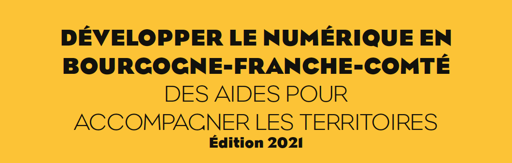

# Guide des aides numériques

La numérisation de l’économie, de la société et des territoires est porteuse d’opportunités, de nouveaux services, de développement économique, d’emplois, de dynamique rurale et de préservation de l’environnement. 

La crise sanitaire et économique de la COVID-19 a mis en exergue l’importance des réseaux de télécommunication et des usages. Télétravail, visioconférence, continuité pédagogique, relations sociales ou accès aux contenus culturels sont autant d’exemples démontrant la montée en puissance du numérique. Pour conduire cette transition numérique, la Région participe et subventionne le déploiement des infrastructures numériques et accompagne le développement des usages.

**TROIS PRIORITÉS** FONDENT LA POLITIQUE PUBLIQUE DES USAGES NUMÉRIQUES :

* Donner à tous **les citoyens** les moyens de bénéficier de la transition numérique.
* Faire de la transition numérique un moteur de **la dynamique économique régionale**.
* Faire du numérique un levier au service de **l’aménagement durable des territoires et de l’environnement**.

**LA RÉGION BOURGOGNE-FRANCHE-COMTÉ** VOUS AIDE POUR :

* **Accélérer le déploiement des infrastructures numériques** : accès mobile et fixe pour tous les usagers du territoire. Déploiement général du Très Haut Débit, via la fibre optique, les réseaux filaires \(ADSL, VDSL\), le satellite ou grâce aux technologies radio comme RCube THD, premier réseau de Très haut débit radio pour les territoires ruraux.
* **Accompagner la transformation numérique du territoire** : accompagnement du citoyen et développement de nouveaux usages numériques pour faciliter la vie des citoyens \(mobilité, éducation, modes de travail, tourisme…\).
* **Structurer une démarche de territoire intelligent et durable.**



> Notre société vit une situation sans précèdent d’urgence climatique et sanitaire qui nous impose de repenser profondément nos politiques publiques pour répondre aux défis de la transformation de notre économie et de l’aménagement de nos territoires.
>
> La période de crise sanitaire a rappelé avec plus de force encore l’urgence de ces sujets, et la nécessité, pour chacun, de bénéficier de la continuité pédagogique, de l’accès aux soins par la téléconsultation médicale, la commande en ligne auprès des commerces de proximité… 
>
> Mais cette accélération des usages du numérique, qui va continuer de bouleverser notre quotidien, ne va pas sans un besoin croissant d’accompagnement, de protection, et d’apprentissage. Nos concitoyens ont autant besoin de l’outil numérique, que d’apprendre à savoir s’en servir et d’en appréhender les dangers. En adoptant sa Politique publique des usages du numérique, la Région Bourgogne- Franche-Comté entend prendre ces sujets à bras le corps et fixer un cap à tenir pour la décennie à venir. 
>
> Au cœur de la démarche se trouve l’émergence d’un vrai **service public du numérique**, dont la mission sera de garantir que l’essor du numérique soit une chance à la fois pour chaque citoyen d’accéder à des services ou des ressources, et pour chaque territoire de bénéficier d’un levier pour l’économie régionale, le développement durable ou la protection de l’environnement. 
>
> C’est dans cette optique que la Région Bourgogne-Franche-Comté a fait du numérique un élément capital de son plan d’accélération de l’investissement régional. Il s’agit notamment d’accompagner les collectivités à se saisir du sujet numérique et d’encourager celles qui s’engagent dans une nouvelle étape de leur transformation, à la recherche d’une plus grande efficacité dans tous les domaines du territoire intelligent. Il s’agit aussi de lutter contre la fracture sanitaire et l’exclusion numérique, protéger l’économie de proximité et soutenir l’aménagement du territoire. 
>
> Marie-Guite DUFAY   
> Présidente de la Région Bourgogne-Franche-Comté

