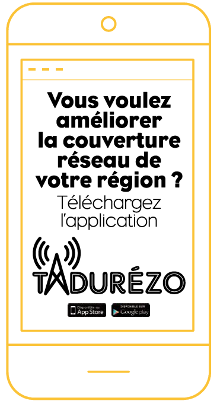

# Accélérer le déploiement des infrastructures numériques

L’accès fixe et mobile à la téléphonie et à l’internet est considéré par la population comme un service essentiel. Mais les opérateurs concernés par le déploiement de ces réseaux n’ont pas d’obligation d’assurer une couverture intégrale du territoire. La Région contribue financièrement et techniquement aux initiatives prises par les pouvoirs publics pour le déploiement de la fibre optique et des réseaux mobiles.

## TADUREZO, UNE APPLICATION PARTICIPATIVE

<table>
  <thead>
    <tr>
      <th style="text-align:left"></th>
      <th style="text-align:left"></th>
    </tr>
  </thead>
  <tbody>
    <tr>
      <td style="text-align:left">
        
      </td>
      <td style="text-align:left">
        
<b>L&#x2019;application participative Tadurezo est un outil de mesure de la couverture mobile</b>.

        

        
Les utilisateurs volontaires t&#xE9;l&#xE9;chargent gratuitement cette
          application sur leur t&#xE9;l&#xE9;phone mobile. Les mesures sont r&#xE9;alis&#xE9;es
          &#xE0; la maison, au travail, en randonn&#xE9;e le week-end...

        
En quelques secondes, l&apos;utilisateur conna&#xEE;t les d&#xE9;bits
          montants et descendants de sa connexion mobile ou le temps moyen de chargement
          d&apos;une page web.

        
Les r&#xE9;sultats des tests sont restitu&#xE9;s sur une carte accessible
          en ligne, qui permet d&#x2019;appr&#xE9;cier la qualit&#xE9; de la couverture
          et du r&#xE9;seau des op&#xE9;rateurs de t&#xE9;l&#xE9;phonie mobile sur
          la r&#xE9;gion.

        
La connaissance fine de la r&#xE9;alit&#xE9; de la couverture mobile,
          de la qualit&#xE9; de service et de leur &#xE9;volution permettra de mieux
          piloter l&#x2019;implantation des futurs pyl&#xF4;nes.

        

        
Pour t&#xE9;l&#xE9;charger l&apos;application :
           <a href="https://play.google.com/store/apps/details?id=fr.qosi.bfc">Sur Google Play</a> 
           <a href="https://apps.apple.com/fr/app/tadurezo-bfc/id1532422807">Sur App Store</a>
        

      </td>
    </tr>
  </tbody>
</table>

### Contact

* Régis Landel - regis.landel@bourgognefranchecomte.fr

## RCUBE THD « MADE IN BOURGOGNEFRANCHE-COMTÉ » !

Pour les zones qui ne bénéficient pas encore du Très Haut Débit terrestre par fibre optique, la Région met en place une solution d’attente utilisant les fréquences hertziennes de la Boucle Locale Radio : Le réseau RCube THD. Cette solution apporte un accès Très Haut Débit \(30 Mbps descendant, 5 remontants\), qui permet des offres ‘triple play’ de qualité sur les territoires les plus ruraux.   
La connexion pour l’abonné se fait à partir d’une antenne placée sur le toit. L’antenne et son installation sont financées par la Région. RCube THD est ouvert aux professionnels et aux particuliers.   
En 2022, le Très Haut Débit sera disponible pour tous.

➔ Pour en savoir plus : [www.rcube.fr](http://www.rcube.fr)

### Contact

* Thierry Bouttier - 03 81 61 61 97 - 06 09 06 65 26 - thierry.bouttier@bourgognefranchecomte.fr


**Près de 1.000 communes** sont significativement couvertes par 100 émetteurs sur les départements de Saône-et-Loire, Côte-d’Or, Yonne et Haute-Saône \(en cours de déploiement\).

**3.000 abonnés** sont desservis en Très Haut Débit, dont un très grand nombre de TPE \(agriculteurs, travailleurs indépendants...\).

**Plus de 200 entreprises** sont raccordées.


