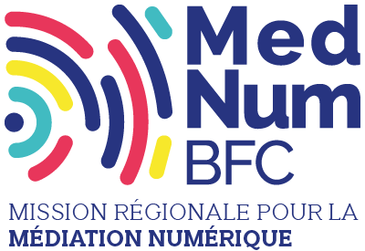

# Pass numériques : lutte contre l’illectronisme et inclusion numérique

### Pourquoi ?

**Le Pass numérique répond aux besoins de montée en compétence des citoyens en matière de d'utilisation des outils numériques**. Ce dispositif se matérialise par des carnets de 5 ou 10 Pass d’une valeur faciale unitaire de 10 €. Ils donnent accès à des services d’accompagnement dans des structures de proximité préalablement identifiées et qualifiées.

### Pour qui ?

Les Pass numériques seront déployés auprès des **jeunes de 16 à 25 ans** en recherche d’emploi et ne poursuivant pas d’études. La Région s’appuie sur le réseau des Missions Locales pour atteindre cette cible. Les jeunes bénéficieront d’un crédit d’heures d’accompagnement dont le coût sera pris en charge totalement ou partiellement par les Pass numériques.

### Combien ?

**50.000 Pass numériques** co-financés par l'État et la Région Bourgogne-Franche-Comté diffusés par les missions locales à compter du second semestre 2021.

### Contact

* Bruno Louis Séguin - 03 80 44 41 48 - brunolouis.seguin@bourgognefranchecomte.fr


\*\*\*\*

La **mission régionale pour la médiation numérique** \(MedNum BFC\) s’articule autour de 4 axes : animer le réseau régional, labelliser les structures de la médiation numérique, les accompagner à consolider leurs modèles économiques et outiller les aidants numérique par le développement de parcours et de supports pédagogiques.   
[www.mednum-bfc.fr](https://www.mednum-bfc.fr)


